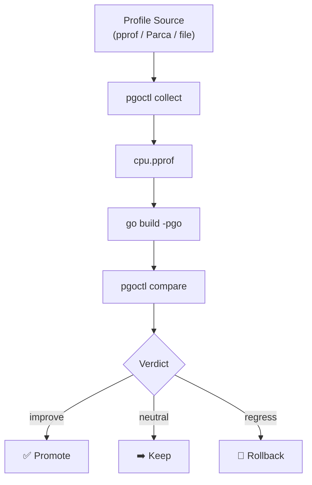

# pgoctl

<!-- Badges activate on public launch — pkg.go.dev, Codecov, and Latest Release resolve once the repo is public and v0.1.0-alpha is published. -->
<p align="center">
  <a href="https://github.com/better-go-labs/pgoctl/actions/workflows/build.yml"></a>
  <a href="https://github.com/better-go-labs/pgoctl/actions/workflows/golangci-lint.yml"></a>
  <a href="https://github.com/better-go-labs/pgoctl/actions/workflows/vulncheck.yml"></a>
  <a href="https://codecov.io/gh/better-go-labs/pgoctl"></a>
  <br>
  <a href="https://github.com/better-go-labs/pgoctl/actions/workflows/smoke.yml"></a>
  <a href="https://pkg.go.dev/github.com/Better-Go-Labs/pgoctl"></a>
  <a href="https://github.com/better-go-labs/pgoctl/releases/latest"></a>
  
  
</p>

`pgoctl` is a CLI application that turns Go profiles into optimized builds with measurable CPU and latency gains.

## Pipeline



## Contents

- [Quick start](#quick-start)
  - [Via pprof endpoint](#via-pprof-endpoint-any-go-service)
  - [Via Parca](#via-parca-continuous-profiling)
  - [GitHub Action](#github-action-ci-integration)
  - [Smoke test](#smoke-test-no-external-services-required)
- [CLI reference](#cli-reference)
  - [collect, via pprof endpoint](#via-go-pprof-http-endpoint)
  - [collect, via Parca](#via-parca-continuous-profiling-server)
  - [validate](#pgoctl-validate)
  - [merge](#pgoctl-merge)
  - [explain](#pgoctl-explain)
  - [compare](#pgoctl-compare)
- [GitHub Action](#github-action)
- [Docker](#docker)
- [Configuration](#configuration)
- [Demo service](#demo-service)
- [Requirements](#requirements)
- [Project layout](#project-layout)
- [Status](#status)
- [License](#license)

## Quick start

### Via pprof endpoint (any Go service)

Works with any Go service that imports `net/http/pprof`. No Parca required.

```bash
go build -o bin/pgoctl ./cmd/pgoctl

# Collect via pgoctl (recommended)
pgoctl collect --source=pprof --url="http://localhost:6060/debug/pprof/profile?seconds=30"

# Or collect manually with curl
curl -o cpu.pprof "http://localhost:6060/debug/pprof/profile?seconds=30"

# Validate, merge, and build with PGO
pgoctl validate cpu.pprof
pgoctl merge cpu.pprof --out default.pgo
go build -pgo=default.pgo -o myapp ./cmd/myapp
```

Or use `demo.sh` with an existing file:

```bash
PROFILE_FILE=cpu.pprof ./demo.sh
```

### Via Parca (continuous profiling)

```bash
go build -o bin/pgoctl ./cmd/pgoctl
PARCA_URL=http://localhost:7070 ./demo.sh
```

`demo.sh` runs collect, validate, merge, build, and explain end to end against your Parca server.

### GitHub Action (CI integration)

> The Action is currently in this repo and used internally. Once the repo is public it will be
> referenceable as `better-go-labs/pgoctl@v0.1.0`.

From a pre-collected pprof file (skips collect):

```yaml
- uses: better-go-labs/pgoctl@v0.1.0
  with:
    profile-file: cpu.pprof      # pre-collected pprof; skips the collect step
    github-token: ${{ secrets.GITHUB_TOKEN }}
```

From a live pprof endpoint:

```yaml
- uses: better-go-labs/pgoctl@v0.1.0
  with:
    pprof-url: http://localhost:6060
    github-token: ${{ secrets.GITHUB_TOKEN }}
```

From a Parca server:

```yaml
- uses: better-go-labs/pgoctl@v0.1.0
  with:
    parca-url: http://parca:7070
    github-token: ${{ secrets.GITHUB_TOKEN }}
```

### Smoke test (no external services required)

```bash
make smoke
```

Generates a synthetic CPU profile and runs the full pipeline end to end. All 7 checks must pass.

## CLI reference

### `pgoctl collect`

Fetch a CPU profile from a running service. Two backends are supported.

#### Via Go pprof HTTP endpoint

Any Go service with pprof enabled (`import _ "net/http/pprof"`) exposes a raw CPU profile endpoint. Use `pgoctl collect` directly, or fall back to curl:

```bash
# Recommended: collect via pgoctl
pgoctl collect --source=pprof \
  --url="http://localhost:6060/debug/pprof/profile?seconds=30" \
  --out=cpu.pprof

# Alternative: collect manually with curl
curl -o cpu.pprof "http://localhost:6060/debug/pprof/profile?seconds=30"

# Validate and merge as normal
pgoctl validate cpu.pprof
pgoctl merge cpu.pprof --out default.pgo
```

| Flag | Default | Description |
|------|---------|-------------|
| `--source` | _(required)_ | Profiling backend: `parca` or `pprof` |
| `--url` | _(required when source=pprof)_ | Full URL of the pprof HTTP endpoint |
| `--out` | `cpu.pprof` | Output file path |
| `--timeout` | _(source-specific)_ | HTTP request timeout |

The endpoint is `GET /debug/pprof/profile?seconds=<N>`, standard on any Go binary that imports `net/http/pprof`. The standalone `cmd/baseline` collector wraps this for Prometheus (`make collect-baseline`).

#### Via Parca (continuous profiling server)

```
pgoctl collect --source=parca \
  --parca-addr=<base-url> \
  --query=<selector> \
  [--window=5m] \
  [--out=cpu.pprof]
```

| Flag | Default | Description |
|------|---------|-------------|
| `--source` | _(required)_ | Profiling backend: `parca` or `pprof` |
| `--parca-addr` | _(required when source=parca)_ | Base URL of the Parca server (e.g. `http://localhost:7070`) |
| `--query` | `process_cpu:cpu:nanoseconds:cpu:nanoseconds:delta` | Parca label selector |
| `--window` | `5m` | Time window for the merged profile (e.g. `5m`, `1h`) |
| `--out` | `cpu.pprof` | Output path (`-` for stdout) |

Calls `POST /parca.query.v1alpha1.QueryService/MergeProfile`, decodes the base64 pprof response, and validates it before writing. No extra Go dependencies.

---

### `pgoctl validate`

Score a CPU pprof for quality before merging.

```
pgoctl validate [flags] <path>
```

| Flag | Default | Description |
|------|---------|-------------|
| `--min-samples` | `10000` | Minimum sample count |
| `--min-duration` | `10.0` | Minimum profile duration in seconds |
| `--min-score` | `0.6` | Minimum quality score (0-1) |
| `--min-package-share` | _(none)_ | Minimum combined flat CPU % for a package prefix (e.g. `tsdb:5`) |
| `--json` | `false` | JSON output |

Exit codes: **0** = valid, **1** = below quality gate, **2** = input error.

Flags can also be set via env vars (`PGOCTL_MIN_SAMPLES=...`) or a `pgoctl.conf` YAML file. See [Configuration](#configuration).

---

### `pgoctl merge`

Merge validated CPU profiles into a `default.pgo` artifact.

```
pgoctl merge [flags] <profile...>
```

| Flag | Default | Description |
|------|---------|-------------|
| `--strategy` | `weighted` | Merge strategy: `weighted`, `latest`, `union` |
| `--recency-weight` | `2.0` | Multiplier for the most recent profile |
| `--half-life` | `24.0` | Recency decay half-life in hours |
| `--drop-invalid` | `false` | Skip unparseable profiles instead of failing |
| `--out` | `default.pgo` | Output path (`-` for stdout) |

---

### `pgoctl explain`

Analyse a pprof file in human-readable form.

```
pgoctl explain [--top N] [--format text|json] <path>
```

| Flag | Default | Description |
|------|---------|-------------|
| `--top` | `20` | Number of top functions to show |
| `--format` | `text` | Output format: `text` or `json` |

Prints the top hot functions by flat CPU share, groups them by package, and gives a plain-English PGO readiness verdict:

- **ready**: >= 50 000 samples across >= 20 functions: good PGO baseline
- **borderline**: 10 000-49 999 samples: will work, denser profile improves inlining
- **not-ready**: < 10 000 samples or < 20 functions: collect a richer profile first

---

### `pgoctl compare`

Compare two CPU profiles and emit a gate verdict.

```
pgoctl compare [flags] <baseline.pprof> <candidate.pprof>
```

| Flag | Default | Description |
|------|---------|-------------|
| `--min-improvement` | `3.0` | Min CPU delta % to promote |
| `--min-regression` | `3.0` | Min CPU regression % to rollback |
| `--min-cpu-percent` | `0.0` | Drop functions below this CPU % in both profiles |
| `--top` | `10` | Number of function deltas to show |
| `--json` | `false` | JSON output |

Verdict: **promote** (improvement >= threshold), **rollback** (regression >= threshold), or **neutral**.
Exit codes: **0** = promote or neutral, **1** = rollback, **2** = input error.

---

## GitHub Action

`action.yml` at the repo root is a composite Action that runs the full pgoctl pipeline in CI: collect (or reuse an existing profile), validate, and compare against a baseline, then optionally uploads the artifact and posts a verdict comment on the PR.

> Currently for use within this repo (`./`). Once published publicly,
> the reference will be `better-go-labs/pgoctl@v0.1.0`.

### Inputs

| Input | Description |
|-------|-------------|
| `parca-url` | Parca server URL (collect step; omit if using `profile-file`) |
| `pprof-url` | Go pprof HTTP endpoint base URL (e.g. `http://localhost:6060`; collect step; omit if using `profile-file` or `parca-url`) |
| `profile-file` | Path to a pre-collected pprof file (skips collect) |
| `baseline-profile` | Baseline pprof for the compare step |
| `duration` | Collection duration |
| `min-improvement` | Promote threshold (CPU delta %) |
| `min-regression` | Rollback threshold (CPU regression %) |
| `validate-flags` | Extra flags passed to `pgoctl validate` |
| `artifact-name` | Name for the uploaded artifact |
| `upload-artifact` | Whether to upload the artifact (default: `true`) |
| `comment-on-pr` | Whether to post a verdict comment (default: `true`) |
| `github-token` | Token used to post the PR comment |
| `restore-previous-artifact` | Auto-download the most recent successful artifact for steady-state profile accumulation (requires `permissions: actions: read`; default: `false`) |
| `previous-profile` | Path to a previous `default.pgo` to merge with — overrides `restore-previous-artifact` if set |

> **Note:** To enable progressive profile accumulation across runs, set `restore-previous-artifact: true` in your workflow.
> The calling workflow must have `permissions: actions: read` for cross-run artifact download.

### Outputs

| Output | Description |
|--------|-------------|
| `verdict` | `promote`, `neutral`, or `rollback` |
| `profile-path` | Path to the collected/used profile |
| `artifact-path` | Path to the produced artifact |
| `validate-score` | Quality score from `pgoctl validate` |

## Docker

A multi-stage `Dockerfile` builds a static, non-root image (~10MB).

```bash
docker build -t pgoctl .
docker run --rm pgoctl --help
```

Builder stage: `golang:1.26-alpine`, `CGO_ENABLED=0`, `-trimpath -ldflags="-s -w"`. Runtime stage: `gcr.io/distroless/static-debian12:nonroot`.

## Configuration

All `pgoctl validate` flags can be set from a config file or environment variable.

| Source | Example |
|--------|---------|
| CLI flag | `pgoctl validate --min-score 0.9 cpu.pprof` |
| Env var | `PGOCTL_MIN_SCORE=0.9 pgoctl validate cpu.pprof` |
| Config file | `pgoctl.conf` (YAML), see [pgoctl.conf.example](pgoctl.conf.example) |

Precedence: **CLI flag > env var > config file > built-in default**.

Config file is discovered as `pgoctl.conf` in `./`, `~/.config/pgoctl/`, then `/etc/pgoctl/`. Missing file is not an error.

```yaml
# pgoctl.conf (example)
min-samples: 1000
min-score: 0.3
min-package-share:
  - github.com/prometheus/prometheus/tsdb:5.0
  - github.com/prometheus/prometheus/promql:1.5
```

## Demo service

We benchmark against **Prometheus** (pure Go, pprof-enabled by default, widely deployed on Kubernetes).

`demo.sh` runs the interactive happy-path pipeline. Set `PARCA_URL` to point it at your Parca server, or set `PROFILE_FILE` to use an existing pprof and skip collect entirely.

## Requirements

### Required

- Go 1.26+ (per `go.mod`)

### Optional (local dev cluster and benchmarking)

- [kind](https://kind.sigs.k8s.io/) + [kubectl](https://kubernetes.io/docs/tasks/tools/) + [helm](https://helm.sh/)
- [hey](https://github.com/rakyll/hey) (HTTP load generator)

## Project layout

```
cmd/
  pgoctl/     -- CLI entry point (validate/merge/compare/explain/collect)
  baseline/   -- standalone pprof collector for dev/baseline capture
internal/
  collect/    -- pprof and Parca HTTP adapters, source interface
  compare/    -- profile comparison and gate logic
  explain/    -- flat CPU attribution, package grouping, PGO verdict
  merge/      -- weighted profile merge strategies
  validate/   -- quality scoring, package-share gates
scripts/
  kind-prometheus.sh  -- provision kind cluster + kube-prometheus-stack
  smoke.sh            -- e2e smoke test (no external service required)
testdata/             -- captured .pprof files (LFS)
demo.sh               -- interactive happy-path demo
BENCHMARKS.md         -- before/after PGO numbers
```

## Status

v0.1.0. See [BENCHMARKS.md](BENCHMARKS.md) for before/after PGO numbers on Prometheus.

## License

Apache 2.0 (see [LICENSE](LICENSE)).
